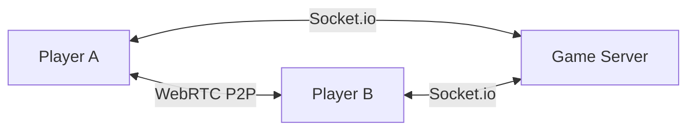

<p align="center">
  
</p>

# 🃏 Open Jocker

<p align="center">
  
  
  
  
  
</p>

---

## 💡 Project Idea

**Open Jocker** is a high-performance, real-time multiplayer card game (Judgement/Jocker) designed for the modern web. The core philosophy is **simplicity and accessibility**:
- **Zero Database Architecture**: All game states are managed in-memory for lightning-fast responsiveness.
- **Integrated Voice Experience**: Built-in P2P voice chat allows players to interact naturally without third-party tools.
- **Ephemeral Rooms**: Create a room, share a 6-character code, and start playing immediately.

Whether you're playing on a desktop or a mobile device, Open Jocker provides a seamless, immersive card game experience that captures the thrill of live play.

---

## 🏗️ Architecture

Open Jocker follows a robust Client-Server architecture optimized for real-time synchronization.

### 1. Server-Side (The Brain)
Built with **Node.js** and **Socket.io**, the server acts as the authoritative source of truth.
- **Room Management**: Dynamic creation and cleanup of game rooms.
- **State Machine**: A custom-built game engine handles phases (Bidding, Playing, Round Transitions).
- **Auto-Play Engine**: Sophisticated logic to handle disconnected players, ensuring the game never stalls.
- **Signaling Server**: Orchestrates WebRTC handshakes for peer-to-peer voice communication.

### 2. Client-Side (The Experience)
A modern **React 18** SPA powered by **Vite**.
- **State Management**: Uses **Zustand** for lightweight, performant global state.
- **Real-time Sync**: Synchronizes local game state with the server via optimized Socket.io events.
- **Voice Stack**: Implements **simple-peer** for low-latency P2P audio streaming.
- **Responsive UI**: Styled with **Tailwind CSS**, providing a premium dark-mode aesthetic across all screen sizes.

### 3. Communication Flow


---

## 🚀 Key Features

- **🎮 Real-time Gameplay**: Instant card updates and bidding synchronization.
- **🎙️ P2P Voice Chat**: Crystal clear audio using WebRTC technology.
- **🤖 Intelligent Auto-Play**: Automatically plays cards for disconnected players to keep the flow.
- **📱 Mobile First**: Fully responsive layout optimized for touch and mouse input.
- **💬 Live Chat**: Integrated text chat for social interaction.
- **📊 Real-time Scoreboard**: Comprehensive history and cumulative scoring tracking.

---

## 🛠️ Getting Started

### Prerequisites
- **Node.js** 20.x or higher
- **npm** or **yarn**

### Installation

1. **Clone the repository:**
   ```bash
   git clone https://github.com/your-username/open-jocker.git
   cd open-jocker
   ```

2. **Install Dependencies:**
   ```bash
   # Install server & client dependencies
   npm install
   cd client && npm install && cd ../server && npm install && cd ..
   ```

### Running Locally

**Terminal 1: Start Backend**
```bash
cd server
node index.js
```

**Terminal 2: Start Frontend**
```bash
cd client
npm run dev
```

Visit `http://localhost:5173` to start playing!

---

## 📦 Deployment

The project is ready for containerized deployment.

```bash
docker build -t open-jocker .
docker run -p 3000:3000 open-jocker
```

**Recommended Host:** [Railway](https://railway.app/) (Auto-detects Dockerfile).

---
<p align="center">Made with ❤️ for the card game community</p>
